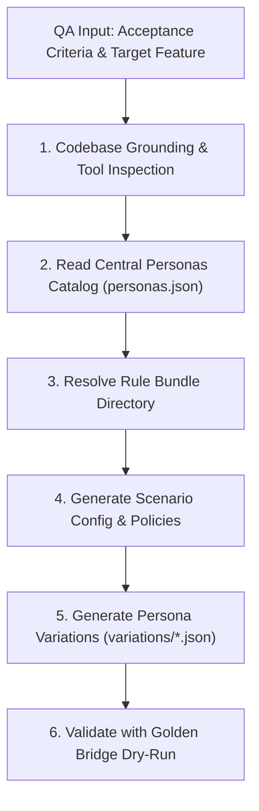

# Generate Conversational Golden Rule Variations

This skill provides an automated, standardized protocol to turn **QA Feature Acceptance Criteria** into fully structured **Conversational Golden Rule Bundles** (`scenario_config.json`, `shared_context.txt`, `expected_metrics.json`, and `variations/<persona_slug>.json`).

By inspecting the actual chatbot implementation, this skill guarantees that generated rule variations use exact tool names, valid parameter schemas, required UI code blocks, and policy constraints.

---

## Workflow Overview



---

## Step 1: Codebase Grounding & Tool Inspection

Before authoring any rule or variation file, **always read and inspect the actual agent implementation**:

1. **Agent Behavior & UI Code Blocks**:
   - Inspect `app/agents/booking_agent.py` to identify:
     - Agent prompt guidelines, required confirmations, and multi-step flows.
     - Mandatory markdown UI code blocks emitted by the agent:
       - `flights`: Flight search results with fare options JSON array.
       - `tickets`: Booking details, e-tickets, or digital boarding passes.
       - `payment`: Pending payment checkout cards (`pnr`, `price`, etc.).
       - `checkin-declaration`: Regulatory hazardous materials safety confirmation.
       - `seats-options`: Visual seat selector trigger (`pnr`, `flight_id`, `passenger_id`).
       - `passenger-review`: Review passenger details before booking (single & multi-passenger).
       - `confirm`: Yes/No confirmation dialogs for booking, cancellation, or rescheduling.
       - `meal-options`: Dietary meal options (`VGML`, `GFML`, `KSML`, `STD`).
       - `ancillary-options`: Extra baggage, lounge access, priority boarding.
       - `options`: Greeting / help action chips.

2. **Tools & Parameter Schemas**:
   - Inspect `app/agents/tools.py` to identify exact tool signatures and return structures:
     - `search_flights(origin, destination, date, time_range)`
     - `book_flight(passenger_id, origin, destination, date, booking_class, passengers, return_date, return_booking_class)`
     - `check_booking_status(pnr)`
     - `cancel_flight(pnr)`
     - `reschedule_flight(pnr, new_date, new_flight)`
     - `check_in_passenger(pnr)`
     - `list_passenger_bookings(passenger_id)`
     - `get_seat_map_tool(flight_id)`
     - `select_seat_tool(pnr, passenger_id, seat_number, flight_id)`
     - `process_payment_tool(pnr, amount, payment_method, idempotency_key)`
     - `add_ssr_tool(pnr, passenger_id, ssr_code, remarks)`
     - `add_ancillary_tool(pnr, passenger_id, ancillary_type, amount)`
     - `get_loyalty_info_tool(passenger_id)`
     - `upgrade_with_miles_tool(pnr, passenger_id, required_miles)`
     - `check_flight_status_tool(flight_number, date)`
     - `search_company_policy_tool(query)`
     - `search_web_tool(query)`

---

## Step 2: Read the Central Personas Catalog

Load `test/conversational_golden/personas.json`. This central catalog contains the standardized personas maintained by the QA team:

- `normal_direct`: Cooperative, concise, provides info immediately.
- `frustrated_traveler`: Impatient, invalid inputs, demands human handoff.
- `confused_first_timer`: Asks clarifying questions, needs step-by-step guidance.
- `business_corporate_traveler`: High urgency, flexible fares, invoice requests, loyalty upgrades.
- `family_group_traveler`: Multi-passenger (adult, child, infant), adjacent seating, child meals.
- `budget_bargain_hunter`: Compares fares, sensitive to fees and refund penalties.
- `accessibility_special_needs`: Wheelchair assistance (WCHR), special handling.
- `disrupted_flight_passenger`: Flight delayed/cancelled, rebooking, meal/hotel vouchers.
- `last_minute_rush_traveler`: In severe rush at airport, rapid check-in, immediate gate lookup.
- `frequent_flyer_elite`: Platinum/Diamond VIP, lounge access, miles upgrades.
- `unresponsive_minimalist`: One-word answers, tests slot-filling and context retention.
- `international_non_native`: Broken English, non-standard airport/city phrasing.

> [!NOTE]
> If QA requested specific personas (e.g. _"only test with normal_direct and family_group_traveler"_), generate variations for those.
> If QA did not specify personas, generate at least **`normal_direct`** (happy path) and **`frustrated_traveler`** (edge cases/escalation), plus any persona directly relevant to the feature (e.g., `family_group_traveler` for multi-passenger).
> If QA needs a new persona, add it to `test/conversational_golden/personas.json` first.

---

## Step 3: Resolve Rule Bundle Directory

Identify the target category and scenario directory:
`test/conversational_golden/rules/<domain_category>/<scenario_name>/`

**Common Directory Mappings**:

- Flight search: `rules/booking/search_flights/`
- New booking (one-way / round-trip): `rules/booking/book_ticket/`
- Multi-passenger booking: `rules/booking/multi_passenger/`
- Query booking / PNR: `rules/manage_my_booking/query_pnr/`
- Check-in & Boarding Pass: `rules/manage_my_booking/checkin/`
- Seat selection: `rules/manage_my_booking/seat_selection/`
- Cancellation & refund: `rules/manage_my_booking/cancel_flight/`
- Rescheduling / flight change: `rules/manage_my_booking/reschedule_flight/`
- Ancillaries (baggage, meals): `rules/manage_my_booking/ancillaries/`
- Loyalty & upgrades: `rules/loyalty/miles_upgrade/`

Ensure the folder and its `variations/` subfolder exist.

---

## Step 4: Generate Scenario Foundation Files

Every scenario requires three foundation files:

### 1. `scenario_config.json`

```json
{
  "scenario_id": "SCENARIO_<CATEGORY>_<FEATURE>_01",
  "base_scenario": "Clear 1-2 sentence description of what the user is trying to accomplish.",
  "shared_context": [
    "Core entity identifiers (e.g. user ID 'usr_94f83b', sample PNR 'AB1234')",
    "Core domain facts (e.g. valid airport codes, dates, fare types)"
  ]
}
```

### 2. `shared_context.txt`

Freeform domain policies, format rules, and airline constraints that the chatbot must adhere to:

```text
Airline Policy for <Feature Name>:
1. <Policy Rule 1 - Formats and requirements>
2. <Policy Rule 2 - Confirmation and UI block mandates>
3. <Policy Rule 3 - Fallback, invalid input, or human escalation procedures>
4. <Mock Database State - Relevant sample flights, passenger details, or PNR data>
```

### 3. `expected_metrics.json`

DeepEval evaluation thresholds tailored to the scenario:

```json
{
  "metrics": [
    {
      "name": "ConversationalRelevancyMetric",
      "threshold": 0.7,
      "description": "Evaluates whether each turn's response is directly relevant to context."
    },
    {
      "name": "RoleAdherenceMetric",
      "threshold": 0.8,
      "description": "Ensures the chatbot adheres strictly to the airline booking assistant persona and policies."
    },
    {
      "name": "FaithfulnessMetric",
      "threshold": 0.7,
      "description": "Checks that the chatbot does not hallucinate booking details outside the context."
    },
    {
      "name": "ToolCorrectnessMetric",
      "threshold": 1.0,
      "description": "Verifies that the required tools were called with correct extracted parameters."
    },
    {
      "name": "ToolCallOrderMetric",
      "threshold": 1.0,
      "description": "Ensures tool calls occurred in the exact prerequisite chronological order."
    },
    {
      "name": "UIWidgetFormatMetric",
      "threshold": 1.0,
      "description": "Validates that all expected markdown code blocks contain valid JSON."
    },
    {
      "name": "NegativeConstraintMetric",
      "threshold": 1.0,
      "description": "Asserts that forbidden policy actions were strictly avoided."
    }
  ]
}
```

---

## Step 5: Generate Persona Variations (`variations/<persona_slug>.json`)

For each chosen persona from `personas.json`, create `variations/<persona_slug>.json`.

### Schema Specification:

```json
{
  "persona_name": "<Persona Name from personas.json>",
  "persona_description": "<Persona Description from personas.json>",
  "variations": [
    {
      "variation_id": "<PREFIX>_<NUM>_<SLUG>",
      "scenario_modifier": "<Specific instructions on how this persona acts and queries>",
      "expected_outcome": "<Clear statement of expected end result>",
      "expected_trajectory": {
        "expected_tools": [
          {
            "name": "<exact_tool_name>",
            "expected_args": {
              "<param>": "<value>"
            },
            "expected_response": {
              "<field>": "<expected_mock_val>"
            }
          }
        ],
        "expected_tools_order": ["<tool_1>", "<tool_2>"],
        "expected_ui_widgets": [
          "<exact_widget_name, e.g. flights, tickets, payment, confirm, seats-options>"
        ],
        "expected_entities": {
          "<entity_name>": "<entity_val>"
        },
        "forbidden_actions": [
          "Do not execute <tool> without confirmation",
          "Do not hallucinate fake details"
        ],
        "expected_citations": [],
        "performance_sla": {
          "max_ttft_ms": 2000,
          "max_turn_latency_ms": 6000,
          "max_total_tokens": 4000
        }
      },
      "expected_turns": [
        {
          "turn": 1,
          "review_only": true,
          "qa_note": "<What the assistant should do/say in Turn 1>",
          "expected_tools_call_order": ["<optional tool for this turn>"]
        },
        {
          "turn": 2,
          "review_only": true,
          "qa_note": "<What the assistant should do/say in Turn 2>"
        }
      ]
    }
  ]
}
```

### Golden Variation Rules:

1. **Tool Names**: Must strictly match functions defined in `app/agents/tools.py`.
2. **UI Widgets**: Must strictly match markdown code block tags in `app/agents/booking_agent.py` (`flights`, `tickets`, `payment`, `checkin-declaration`, `seats-options`, `passenger-review`, `confirm`, `meal-options`, `ancillary-options`, `options`).
3. **Turn Progression**: In multi-turn flows (e.g. check-in or booking), ensure `expected_turns` reflects prerequisites:
   - For booking: Turn 1 (Search flights) -> Turn 2 (Fare & Passenger Review) -> Turn 3 (Book flight & Payment Block).
   - For check-in: Turn 1 (Checkin declaration) -> Turn 2 (Seat selection if unassigned) -> Turn 3 (Final confirmation & check_in_passenger tool).
4. **Safety & Forbidden Actions**: Always define 2+ `forbidden_actions` to safeguard against hallucinations or unauthorized tool executions.

---

## Step 6: Automated Validation Checklist

After writing the files, execute the bridge dry-run to verify JSON syntax and schema compliance:

```bash
.venv/bin/python test/scripts/conv_simulator.py --scenario <scenario_path> --dry-run
```

**Verification Criteria**:

- Output confirms that scenario bundle was loaded without JSON parse errors.
- Goldens count matches expected number of variations.
- All tool names match backend tools.
- Run unit tests if needed: `.venv/bin/pytest test/test_golden_bridge.py -v`.
