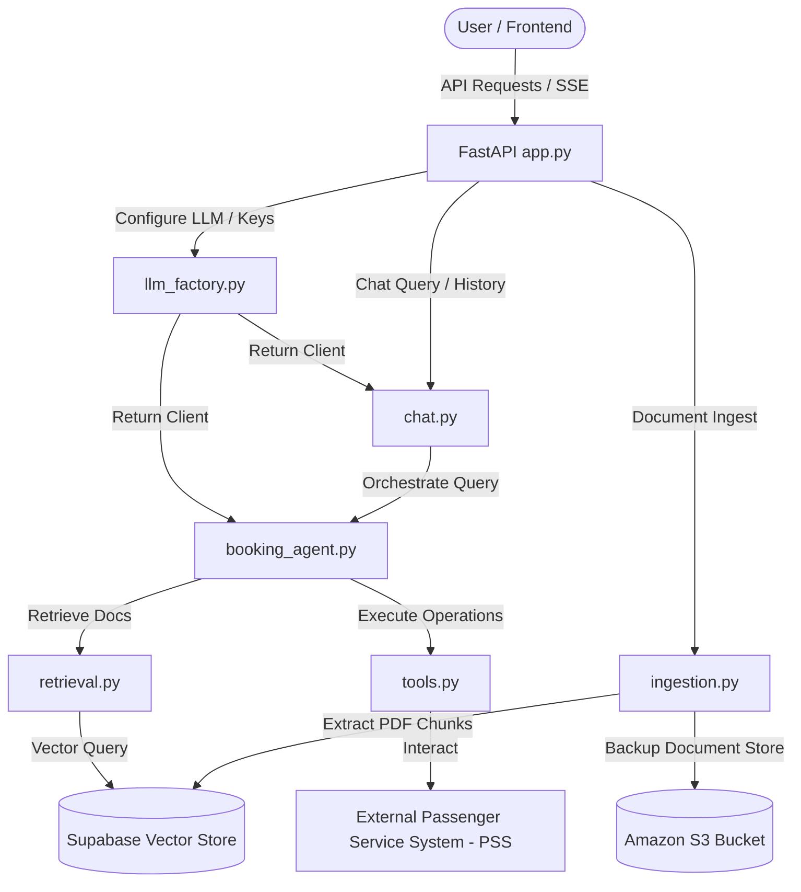

# RAG Chatbot & Airline Booking Agent Backend

This directory contains the FastAPI backend for the RAG Chatbot and Airline Booking Agent system. It provides APIs for document ingestion, real-time RAG chat retrieval, user setting configurations, and a multi-turn agent orchestrator capable of managing airline bookings.

---

## Architecture Overview



---

## Features

- **Unified LLM Factory**: Flexibly switch between local environments (e.g., **LM Studio**) and production providers (e.g., **OpenAI**, **Anthropic**, **Gemini**) via settings.
- **Autonomous Airline Agent**: LangChain tool-calling loop supporting flight search, booking, rescheduling, cancellations, check-in, passenger profile lookups, seat selection, special requests (SSR), and payment processing.
- **RAG Pipeline**: PDF parsing, recursive text splitting, text embedding, and semantic search backed by Supabase vector store and S3.
- **Server-Sent Events (SSE)**: Streaming responses for real-time assistant typing, tool-call alerts, and latency/observability metrics.
- **Observability**: Traceable LangSmith execution integration for debugging agent decision flows.

---

## Getting Started

### Prerequisites
- Python >= 3.13
- A local [LM Studio](https://lmstudio.ai/) server running a tool-compatible model (e.g., `google/gemma-4-e4b` or `qwen2.5`) OR an OpenAI/Anthropic/Gemini API key.

### Installation
Initialize dependencies using Python Virtual Environment:
```bash
python3 -m venv .venv
source .venv/bin/activate
pip install -r requirements.txt
```

### Environment Configuration (`.env`)
Create a `.env` file in the root of this `app` directory with the following variables:
```ini
AWS_ACCESS_KEY_ID=your_aws_key
AWS_SECRET_ACCESS_KEY=your_aws_secret
S3_BUCKET_NAME=your_s3_bucket_name
SUPABASE_URL=https://your_supabase_project.supabase.co
SUPABASE_SERVICE_ROLE_KEY=your_supabase_role_key

# Observability (Optional)
LANGSMITH_TRACING=true
LANGSMITH_API_KEY=your_langsmith_key
LANGSMITH_PROJECT="airline-booking-chatbot"

# API Keys (Optional if configuring via settings.json)
OPENAI_API_KEY=your_openai_key
```

### Settings Configuration (`settings.json`)
The application loads model configs dynamically. You can update this file either manually or by posting to `/settings`:
```json
{
  "env": "local",
  "local_service_provider": "LMStudio",
  "local_model": "google/gemma-4-e4b",
  "lmstudio_api_base": "http://localhost:1234/v1",
  "prod_service_provider": "openai",
  "prod_model": "gpt-4o",
  "openai_api_key": "",
  "anthropic_api_key": "",
  "gemini_api_key": ""
}
```

---

## File Structure & Components

- **`app.py`**: The entrypoint FastAPI application hosting routes for endpoints:
  - `GET /settings` and `POST /settings` — Retrieves and saves LLM configuration.
  - `POST /chat/stream` — Initiates the agent streaming assistant loop (SSE).
  - `POST /ingestion/upload` — Handles PDF document uploads to S3 and triggers embedding/upsertion.
- **`llm_factory.py`**: Reads `settings.json` to generate the configured `ChatModel` instance. Ensures production providers' packages (like `langchain-anthropic` or `langchain-google-genai`) are dynamically imported only when needed.
- **`chat.py`**: Orchestrates Server-Sent Events stream formatting (tokens, tool calls, final output token metrics).
- **`ingestion.py`**: Extracts text from PDF files using `PyMuPDF`, splits text using standard recursive splitters, computes embeddings, and stores index chunks in Supabase vector store.
- **`retrieval.py`**: Implements custom vector retrieval to match user questions against ingested documents.
- **`agents/`**
  - **`booking_agent.py`**: Multi-turn agent loop executing tools and feeding responses back to the model.
  - **`tools.py`**: LangChain structured tools connecting the agent model to the passenger services database/APIs.

---

## Running the Server

Run the development server using `uvicorn`:
```bash
uvicorn app:app --host 0.0.0.0 --port 8000 --reload
```
The API documentation will be available at `http://localhost:8000/docs`.
