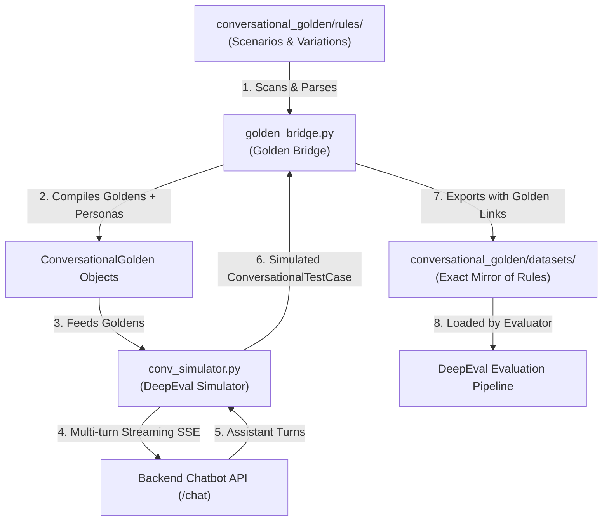

# 🎭 Conversational Golden Suite & DeepEval Simulator

This directory contains the **Conversational Golden Rules**, **Persona Variations**, and **Generated Multi-Turn Datasets** for evaluating the **Airline Booking RAG Chatbot** using **[DeepEval](https://github.com/confident-ai/deepeval)** (v4.2.0).

---

## 🏗️ System Architecture & Workflow

The framework bridges declarative rule definitions into dynamic multi-turn user simulations and exports structured evaluation datasets with complete traceability.



---

## 📁 Directory Structure & 1:1 Parity

The directory structure maintains strict 1:1 structural parity between rule definitions (`rules/`) and generated conversation datasets (`datasets/`):

```
conversational_golden/
├── README.md                                         # This documentation
├── rules/                                            # Declarative rules & variations (Input)
│   ├── booking/
│   │   ├── book_ticket/
│   │   └── search_flights/
│   └── manage_my_booking/
│       ├── cancel_flight/
│       └── query_pnr/
│           ├── scenario_config.json                  # Common scenario config (base scenario, PNR rules)
│           ├── shared_context.txt                    # Freeform airline domain policies
│           ├── expected_metrics.json                 # Target metrics & threshold definitions
│           └── variations/                           # Persona variation files
│               ├── frustrated_traveler.json          # Impatient/angry persona variations
│               └── normal_direct.json                # Direct/polite persona variations
│
└── datasets/                                         # Generated multi-turn simulations (Output)
    └── manage_my_booking/
        └── query_pnr/
            ├── frustrated_traveler/
            │   ├── deterministic_reply/              # 🔒 Deterministic QA Testcases & Replay Runs
            │   │   ├── FRUST_01_INVALID_FORMAT.json
            │   │   └── FRUST_02_DEMANDS_AGENT.json
            │   └── dynamic_simulation/                # 🎲 DeepEval LLM Free-form Generated Conversations
            │       ├── FRUST_01_INVALID_FORMAT.json
            │       └── FRUST_02_DEMANDS_AGENT.json
            ├── normal_direct/
            │   ├── deterministic_reply/
            │   └── dynamic_simulation/
            ├── dataset.json                          # Consolidated scenario dataset
            └── simulation_report.md                  # Human-readable markdown transcript
```

---

## 📝 Rule File Formats & Standards

Every scenario folder under `rules/<domain_category>/<scenario_name>/` contains:

### 1. `scenario_config.json` (Common Scenario Config)

Contains baseline properties shared across all variations for this scenario:

```json
{
  "scenario_id": "SCENARIO_PNR_01",
  "base_scenario": "The user wants to check the status of their flight booking using a PNR.",
  "shared_context": [
    "A valid PNR must be exactly 6 alphanumeric characters.",
    "The user's actual valid PNR is 'AB1234', which is for an AI-101 flight to Dubai, Status: Confirmed."
  ]
}
```

### 2. `variations/<persona_slug>.json` (Persona Variations)

Defines a specific user persona and a list of scenario modifiers:

```json
{
  "persona_name": "Frustrated Traveler",
  "persona_description": "Highly impatient, easily annoyed, and uses short, aggressive sentences.",
  "variations": [
    {
      "variation_id": "FRUST_01_INVALID_FORMAT",
      "scenario_modifier": "Ask for flight status but provide a 5-letter PNR ('AB123'). When told it is invalid, act annoyed and refuse to provide the correct one.",
      "expected_outcome": "The chatbot politely explains the 6-character requirement and offers a human handoff."
    },
    {
      "variation_id": "FRUST_02_DEMANDS_AGENT",
      "scenario_modifier": "Immediately demand to speak to a human agent to check the PNR without even trying to talk to the bot.",
      "expected_outcome": "The chatbot successfully routes the conversation to a human agent without forcing the user to verify the PNR first."
    }
  ]
}
```

### 3. `expected_metrics.json` (Evaluation Thresholds)

Defines target DeepEval metrics and pass thresholds for this scenario:

```json
{
  "metrics": [
    {
      "name": "ConversationalRelevancyMetric",
      "threshold": 0.7,
      "description": "Evaluates whether each turn's response is directly relevant to context."
    },
    {
      "name": "RoleAdherenceMetric",
      "threshold": 0.8,
      "description": "Ensures the assistant adheres strictly to policies."
    },
    {
      "name": "FaithfulnessMetric",
      "threshold": 0.7,
      "description": "Checks that the chatbot does not hallucinate booking details."
    }
  ]
}
```

### 4. `shared_context.txt` (Domain Policy / Guidelines)

Freeform domain text and business rules merged into the test case context:

```text
Airline Policy for PNR Query:
1. PNR (Passenger Name Record) must consist of exactly 6 uppercase alphanumeric characters.
2. If the user provides a PNR with less or more than 6 characters, inform about the format.
3. If the user is uncooperative or requests an agent, offer immediate human handoff.
```

---

## 🌉 The Golden Bridge (`scripts/golden_bridge.py`)

The bridge script acts as the single interface between files, DeepEval objects, and output exports:

| Function                               | Purpose                                                                                                                   |
| -------------------------------------- | ------------------------------------------------------------------------------------------------------------------------- |
| `discover_scenario_directories()`      | Scans `rules/` and auto-discovers all configured scenario folders.                                                        |
| `load_scenario_bundle(path)`           | Parses scenario config, shared contexts, expected metrics, and all persona variations.                                    |
| `build_conversational_goldens(bundle)` | Synthesizes DeepEval `ConversationalGolden` and `Persona` objects with combined scenarios and **`golden_link`** metadata. |
| `export_simulated_testcase(test_case)` | Saves the generated multi-turn conversation into `datasets/<category>/<scenario>/<persona>/<variation_id>.json`.          |
| `export_scenario_summary(...)`         | Compiles consolidated `dataset.json` and human-readable `simulation_report.md`.                                           |
| `load_dataset_for_evaluation(...)`     | Reloads exported dataset JSONs into `ConversationalTestCase` instances for running evaluation metrics.                    |

---

## 🤖 Generated Dataset Schema & Traceability Link

Each generated JSON file in `datasets/` contains complete conversation turns and the **`golden_link`** inside `metadata` for full traceability back to the source rules:

```json
{
  "testcase_id": "FRUST_01_INVALID_FORMAT",
  "thread_id": "9b12a83e-32fa-4830-a92c-0e86b45e7f12",
  "scenario_description": "The user wants to check the status of their flight booking using a PNR. Ask for flight status but provide a 5-letter PNR ('AB123'). When told it is invalid, act annoyed and refuse to provide the correct one.",
  "expected_outcome": "The chatbot politely explains the 6-character requirement and offers a human handoff.",
  "persona": {
    "name": "Frustrated Traveler",
    "characteristics": "Highly impatient, easily annoyed..."
  },
  "context": [
    "A valid PNR must be exactly 6 alphanumeric characters.",
    "The user's actual valid PNR is 'AB1234'...",
    "Airline Policy for PNR Query: ..."
  ],
  "conversations": {
    "turn 1": [
      {
        "role": "user",
        "content": "Give me my flight details for PNR AB123 immediately!"
      },
      {
        "role": "assistant",
        "content": "A valid booking reference (PNR) must contain exactly 6 characters. Would you like me to connect you with a customer service agent?",
        "expected_content": "Inform user that PNR AB123 is invalid and explain the 6-character requirement.",
        "expected_tools_call_order": [
          "check_booking_status"
        ],
        "actual_tools_call_order": [
          "check_booking_status"
        ],
        "actual_tools_called": [
          {
            "name": "check_booking_status",
            "args": {
              "pnr": "AB123"
            },
            "expected_args": {
              "pnr": "AB123"
            },
            "response": {
              "error": "Booking not found for PNR AB123."
            },
            "expected_response": {
              "error": "Booking not found for PNR AB123."
            }
          }
        ],
        "actual_ui_widgets": [],
        "actual_citations": [],
        "metrics": {
          "ttft_ms": 380.0,
          "latency_ms": 1150.0,
          "input_tokens": 450,
          "output_tokens": 45,
          "total_tokens": 495,
          "cost_usd": 0.000115
        },
        "run_id": "c7a8b9e0-1234-5678-90ab-cdef12345678"
      }
    ]
  },
  "simulated_at": "2026-08-30T14:51:25Z",
  "total_turns": 1,
  "metadata": {
    "golden_link": {
      "rule_category": "manage_my_booking",
      "scenario_name": "query_pnr",
      "scenario_rel_dir": "manage_my_booking/query_pnr",
      "scenario_id": "SCENARIO_PNR_01",
      "scenario_config_path": "/path/to/rules/manage_my_booking/query_pnr/scenario_config.json",
      "variation_file": "/path/to/rules/manage_my_booking/query_pnr/variations/frustrated_traveler.json",
      "persona_slug": "frustrated_traveler",
      "persona_name": "Frustrated Traveler",
      "persona_description": "Highly impatient, easily annoyed, and uses short, aggressive sentences.",
      "variation_id": "FRUST_01_INVALID_FORMAT"
    },
    "thread_id": "9b12a83e-32fa-4830-a92c-0e86b45e7f12",
    "expected_metrics": { ... }
  }
}
```

---

## 🚀 Usage Guide

All commands should be executed from the `test/` directory using the virtual environment:

### 1. Previewing & Validating Rules (`--dry-run`)

Validate that all scenario bundles and persona variations parse cleanly without making LLM or API calls:

```bash
# Preview all discovered goldens and variations
.venv/bin/python scripts/conv_simulator.py --dry-run

# Preview a specific scenario
.venv/bin/python scripts/conv_simulator.py --scenario query_pnr --dry-run

# Preview a specific variation
.venv/bin/python scripts/conv_simulator.py --variation FRUST_01_INVALID_FORMAT --dry-run
```

### 2. Generating Datasets with `conv_simulator.py`

Start your chatbot backend (e.g., `http://localhost:8000/chat`), then run:

```bash
# A) Dynamic Simulation Mode (Default -> saves to dynamic_simulation/)
.venv/bin/python scripts/conv_simulator.py --target dynamic

# B) Deterministic QA Baseline Creation (Saves to deterministic_reply/)
.venv/bin/python scripts/conv_simulator.py --target deterministic

# Filter by category/scenario and specify custom turn limit
.venv/bin/python scripts/conv_simulator.py --category manage_my_booking --scenario query_pnr --max-turns 4

# Non-destructive file safeguard is enabled by default (creates timestamped file if testcase exists)
# Pass --overwrite if you explicitly wish to overwrite:
.venv/bin/python scripts/conv_simulator.py --target deterministic --overwrite
```

### 3. Running Deterministic Replay Evaluation (`conv_replay_evaluator.py`)

Replays fixed user queries turn-by-turn from `deterministic_reply/` against the live chatbot backend and evaluates tool parameters, responses, order, and expected content:

```bash
# Preview deterministic test scripts
.venv/bin/python scripts/conv_replay_evaluator.py --dry-run

# Run full replay evaluation against live backend
.venv/bin/python scripts/conv_replay_evaluator.py --category manage_my_booking

# Run replay evaluation for a specific variation
.venv/bin/python scripts/conv_replay_evaluator.py -v FRUST_01_INVALID_FORMAT
```

### 4. Running Automated Test Suite

To verify the bridge, golden compiler, and dataset exporter:

```bash
.venv/bin/pytest test_golden_bridge.py -v
```
