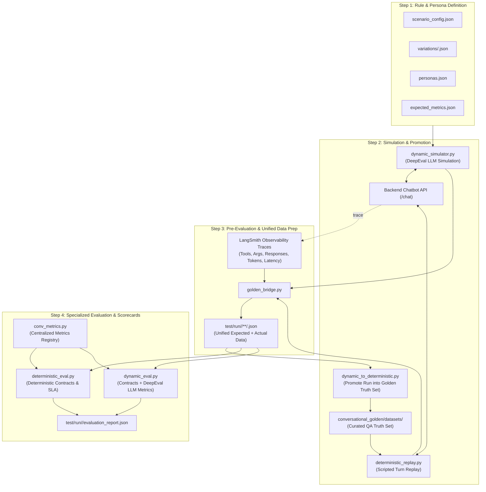

# 🎭 Conversational Golden Suite & DeepEval Simulator

This directory contains the **Conversational Golden Rules**, **Persona Variations**, and **Generated Multi-Turn Datasets** for evaluating the **Airline Booking RAG Chatbot** using **[DeepEval](https://github.com/confident-ai/deepeval)** (v4.2.0).

---

## 🏗️ System Architecture & Workflow

The framework bridges declarative rule definitions into dynamic multi-turn user simulations, extracts real-time execution traces from LangSmith, and evaluates conversations using DeepEval and deterministic contract checks.



---

## 📁 Directory Structure & 1:1 Parity

The framework maintains strict 1:1 directory hierarchy parity across rules, runtime runs, and baseline datasets:

```
test/
├── conversational_golden/
│   ├── README.md                                     # This documentation
│   ├── personas.json                                 # Central catalog of 12 reusable traveler personas
│   ├── rules/                                        # Declarative rules & variations (Input)
│   │   ├── booking/
│   │   │   ├── book_ticket/
│   │   │   └── search_flights/
│   │   └── manage_my_booking/
│   │       ├── cancel_flight/
│   │       └── query_pnr/
│   │           ├── scenario_config.json              # Common scenario config (base scenario, PNR rules)
│   │           ├── shared_context.txt                # Freeform airline domain policies
│   │           ├── expected_metrics.json             # Target metrics & threshold definitions
│   │           └── variations/                       # Persona variation files
│   │               ├── frustrated_traveler.json      # Impatient/angry persona variations
│   │               └── normal_direct.json            # Direct/polite persona variations
│   │
│   └── datasets/                                     # 🎯 Curated Ground Truth Test Cases (Git Versioned)
│       └── <domain_category>/
│           └── <scenario_name>/
│               └── <persona_slug>/
│                   └── deterministic_reply/          # 🔒 Turn-by-turn human-editable test cases for regression
│                       └── <variation_id>.json
│
└── run/                                              # ⏱️ Execution Run Artifacts (Timestamped & Immutable)
    └── <YYYY-MM-DD_HH-MM-SS>/                        # Specific execution run
        ├── manage_my_booking/
        │   └── query_pnr/
        │       ├── frustrated_traveler/
        │       │   ├── deterministic_reply/          # Execution outputs from deterministic replay
        │       │   │   └── FRUST_01_INVALID_FORMAT.json
        │       │   └── dynamic_simulation/           # Execution outputs from dynamic LLM simulation
        │       │       └── FRUST_01_INVALID_FORMAT.json
        │       └── normal_direct/
        │           ├── deterministic_reply/
        │           └── dynamic_simulation/
        └── evaluation_report.json                    # Evaluation scorecard & metrics report
```

---

## 📝 Rule File Formats & Standards

Every scenario folder under `rules/<domain_category>/<scenario_name>/` contains:

### 1. `scenario_config.json` (Common Scenario Config)

Contains baseline properties shared across all variations for this scenario:

```json
{
  "scenario_id": "SCENARIO_PNR_01",
  "base_scenario": "The user wants to check the status of their flight booking using a PNR.",
  "shared_context": [
    "A valid PNR must be exactly 6 alphanumeric characters.",
    "The user's actual valid PNR is 'AB1234', which is for an AI-101 flight to Dubai, Status: Confirmed."
  ]
}
```

### 2. `variations/<persona_slug>.json` (Persona Variations)

Defines a specific user persona and a list of scenario modifiers:

```json
{
  "persona_name": "Frustrated Traveler",
  "persona_description": "Highly impatient, easily annoyed, and uses short, aggressive sentences.",
  "variations": [
    {
      "variation_id": "FRUST_01_INVALID_FORMAT",
      "scenario_modifier": "Ask for flight status but provide a 5-letter PNR ('AB123'). When told it is invalid, act annoyed and refuse to provide the correct one.",
      "expected_outcome": "The chatbot politely explains the 6-character requirement and offers a human handoff."
    },
    {
      "variation_id": "FRUST_02_DEMANDS_AGENT",
      "scenario_modifier": "Immediately demand to speak to a human agent to check the PNR without even trying to talk to the bot.",
      "expected_outcome": "The chatbot successfully routes the conversation to a human agent without forcing the user to verify the PNR first."
    }
  ]
}
```

### 3. `expected_metrics.json` (Evaluation Thresholds)

Defines target DeepEval metrics and pass thresholds for this scenario:

```json
{
  "metrics": [
    {
      "name": "ConversationalRelevancyMetric",
      "threshold": 0.7,
      "description": "Evaluates whether each turn's response is directly relevant to context."
    },
    {
      "name": "RoleAdherenceMetric",
      "threshold": 0.8,
      "description": "Ensures the assistant adheres strictly to policies."
    },
    {
      "name": "FaithfulnessMetric",
      "threshold": 0.7,
      "description": "Checks that the chatbot does not hallucinate booking details."
    }
  ]
}
```

### 4. `shared_context.txt` (Domain Policy / Guidelines)

Freeform domain text and business rules merged into the test case context:

```text
Airline Policy for PNR Query:
1. PNR (Passenger Name Record) must consist of exactly 6 uppercase alphanumeric characters.
2. If the user provides a PNR with less or more than 6 characters, inform about the format.
3. If the user is uncooperative or requests an agent, offer immediate human handoff.
```

---

## 🌉 The Golden Bridge (`scripts/golden_bridge.py`)

The bridge script acts as the single interface between files, DeepEval objects, and output exports:

| Function                               | Purpose                                                                                                                   |
| -------------------------------------- | ------------------------------------------------------------------------------------------------------------------------- |
| `discover_scenario_directories()`      | Scans `rules/` and auto-discovers all configured scenario folders.                                                        |
| `load_scenario_bundle(path)`           | Parses scenario config, shared contexts, expected metrics, and all persona variations.                                    |
| `build_conversational_goldens(bundle)` | Synthesizes DeepEval `ConversationalGolden` and `Persona` objects with combined scenarios and **`golden_link`** metadata. |
| `export_simulated_testcase(test_case)` | Saves the generated multi-turn conversation into `datasets/<category>/<scenario>/<persona>/<variation_id>.json`.          |
| `export_scenario_summary(...)`         | Compiles consolidated `dataset.json` and human-readable `simulation_report.md`.                                           |
| `load_dataset_for_evaluation(...)`     | Reloads exported dataset JSONs into `ConversationalTestCase` instances for running evaluation metrics.                    |

---

## 🤖 Generated Dataset Schema & Traceability Link

Each generated JSON file in `datasets/` contains complete conversation turns and the **`golden_link`** inside `metadata` for full traceability back to the source rules:

```json
{
  "testcase_id": "FRUST_01_INVALID_FORMAT",
  "thread_id": "9b12a83e-32fa-4830-a92c-0e86b45e7f12",
  "scenario_description": "The user wants to check the status of their flight booking using a PNR. Ask for flight status but provide a 5-letter PNR ('AB123'). When told it is invalid, act annoyed and refuse to provide the correct one.",
  "expected_outcome": "The chatbot politely explains the 6-character requirement and offers a human handoff.",
  "persona": {
    "name": "Frustrated Traveler",
    "characteristics": "Highly impatient, easily annoyed..."
  },
  "context": [
    "A valid PNR must be exactly 6 alphanumeric characters.",
    "The user's actual valid PNR is 'AB1234'...",
    "Airline Policy for PNR Query: ..."
  ],
  "conversations": {
    "turn 1": [
      {
        "role": "user",
        "content": "Give me my flight details for PNR AB123 immediately!"
      },
      {
        "role": "assistant",
        "content": "A valid booking reference (PNR) must contain exactly 6 characters. Would you like me to connect you with a customer service agent?",
        "expected_content": "Inform user that PNR AB123 is invalid and explain the 6-character requirement.",
        "expected_tools_call_order": [
          "check_booking_status"
        ],
        "actual_tools_call_order": [
          "check_booking_status"
        ],
        "actual_tools_called": [
          {
            "name": "check_booking_status",
            "args": {
              "pnr": "AB123"
            },
            "expected_args": {
              "pnr": "AB123"
            },
            "response": {
              "error": "Booking not found for PNR AB123."
            },
            "expected_response": {
              "error": "Booking not found for PNR AB123."
            }
          }
        ],
        "actual_ui_widgets": [],
        "actual_citations": [],
        "metrics": {
          "ttft_ms": 380.0,
          "latency_ms": 1150.0,
          "input_tokens": 450,
          "output_tokens": 45,
          "total_tokens": 495,
          "cost_usd": 0.000115
        },
        "run_id": "c7a8b9e0-1234-5678-90ab-cdef12345678"
      }
    ]
  },
  "simulated_at": "2026-08-30T14:51:25Z",
  "total_turns": 1,
  "metadata": {
    "golden_link": {
      "rule_category": "manage_my_booking",
      "scenario_name": "query_pnr",
      "scenario_rel_dir": "manage_my_booking/query_pnr",
      "scenario_id": "SCENARIO_PNR_01",
      "scenario_config_path": "/path/to/rules/manage_my_booking/query_pnr/scenario_config.json",
      "variation_file": "/path/to/rules/manage_my_booking/query_pnr/variations/frustrated_traveler.json",
      "persona_slug": "frustrated_traveler",
      "persona_name": "Frustrated Traveler",
      "persona_description": "Highly impatient, easily annoyed, and uses short, aggressive sentences.",
      "variation_id": "FRUST_01_INVALID_FORMAT"
    },
    "thread_id": "9b12a83e-32fa-4830-a92c-0e86b45e7f12",
    "expected_metrics": { ... }
  }
}
```

---

## 🚀 Step-by-Step Execution Lifecycle

Follow these steps from the `test/` directory using the virtual environment:

### Step 1: Scaffold / Author Rules & Persona Variations

1. **Pick or Add Personas**: Select traveler personas from [`test/conversational_golden/personas.json`](file:///home/so-ra-gh/Dev/my_projects/RAG-Chatbot-Project/test/conversational_golden/personas.json) (12 available profiles including `frustrated_traveler`, `business_traveler`, `elderly_traveler`, etc.).
2. **Auto-Generate with Skill**: Provide QA acceptance criteria to Antigravity and prompt:
   > _"Generate rule variations for one-way flight booking for a budget backpacker and business traveler based on acceptance criteria."_
   > The skill [`.agents/skills/generate-rule-variations/SKILL.md`](file:///home/so-ra-gh/Dev/my_projects/RAG-Chatbot-Project/.agents/skills/generate-rule-variations/SKILL.md) automatically inspects `booking_agent.py` and `tools.py` and scaffolds the 4-file scenario bundle (`scenario_config.json`, `shared_context.txt`, `expected_metrics.json`, `variations/<persona>.json`).

### Step 2: Execute Dynamic Simulation (`dynamic_simulator.py`)

Run dynamic multi-turn persona simulation against the live chatbot API:

```bash
# Preview dynamic simulation goldens
.venv/bin/python scripts/dynamic_simulator.py --scenario query_pnr --dry-run

# Run dynamic simulation and save traces into test/run/<timestamp>/...
.venv/bin/python scripts/dynamic_simulator.py --scenario query_pnr
```

### Step 3: Promote Approved Conversations to Deterministic Truth Set (`dynamic_to_deterministic.py`)

Once QA reviews dynamic simulation outputs and identifies a realistic, successful conversation run, promote it to become the official ground truth in `datasets/`:

```bash
# Promote a specific dynamic run file into datasets/
.venv/bin/python scripts/dynamic_to_deterministic.py test/run/latest/.../FRUST_01_INVALID_FORMAT.json

# Batch promote all dynamic runs from the latest run
.venv/bin/python scripts/dynamic_to_deterministic.py --run latest --scenario query_pnr

# Merge mode: update rules/metadata from rules while preserving QA edits in conversations
.venv/bin/python scripts/dynamic_to_deterministic.py --merge test/run/latest/.../FRUST_01_INVALID_FORMAT.json

# Fallback: Scaffold directly from rules if dynamic run is not yet available
.venv/bin/python scripts/dynamic_to_deterministic.py --from-rules --scenario query_pnr
```

> **Note**: Promoting automatically generates/updates `qa_review.md` and `dataset.json` in the scenario folder for pull request sign-offs.

#### Option B: Deterministic Conversation Replay (`deterministic_replay.py`)

Replays pre-scripted user queries from `datasets/` turn-by-turn against the live backend and captures LangSmith traces:

```bash
# Preview deterministic replay test cases
.venv/bin/python scripts/deterministic_replay.py --dry-run

# Replay against live backend and record traces into test/run/<date_time>/...
.venv/bin/python scripts/deterministic_replay.py --category manage_my_booking
```

### Step 4: Automated Pre-Evaluation & LangSmith Trace Enrichment

During Step 3, the runtime automatically performs **Pre-Evaluation / Unified Data Prep**:

1. Captures the active `thread_id` from the roleplay session.
2. Once the conversation finishes, queries LangSmith to extract complete server execution traces (tools called, inputs, responses, token counts, TTFT, and latency).
3. Merges **Expected Golden Criteria** + **Actual LangSmith Traces** into a single unified JSON file stored under:
   ```
   test/run/<date_time>/<rule_category>/<scenario_name>/<persona_slug>/<target_mode>/<variation_id>.json
   ```
   _(Maintains exact 1:1 directory hierarchy parity with `datasets/`)._

### Step 5: Run Evaluation (`deterministic_eval.py` & `dynamic_eval.py`)

All evaluations leverage the centralized metrics engine in `scripts/conv_metrics.py`:

#### Option A: Evaluate Deterministic Replay Runs (`deterministic_eval.py`)

```bash
# Evaluate latest deterministic run (contract checks: tools, args, order, SLA, widgets)
.venv/bin/python scripts/deterministic_eval.py --run latest

# Filter evaluation by scenario
.venv/bin/python scripts/deterministic_eval.py --scenario query_pnr
```

#### Option B: Evaluate Dynamic Simulation Runs (`dynamic_eval.py`)

```bash
# Run contract checks only (no LLM judge required)
.venv/bin/python scripts/dynamic_eval.py --skip-llm

# Evaluate with DeepEval LLM-as-a-judge metrics (RoleAdherence, Completeness)
.venv/bin/python scripts/dynamic_eval.py --run latest

# Override LLM judge model (e.g. gemini-2.5-flash or gpt-4o-mini)
.venv/bin/python scripts/dynamic_eval.py --run latest --model gemini-2.5-flash
```

**Evaluated Criteria (via `conv_metrics.py`)**:

- 🛠️ **Tool Correctness**: Validates expected tools were called with matching parameters and responses.
- 🔄 **Tool Call Order**: Ensures chronological sequence compliance.
- 📱 **UI Widget Schemas**: Asserts emitted markdown code blocks contain valid JSON (`is_valid_json: true`).
- ⚡ **Performance SLA**: Verifies TTFT, latency, and token budgets against scenario thresholds.
- 🚫 **Negative Constraints**: Verifies forbidden actions were avoided.
- 🤖 **DeepEval LLM Metrics**: Scores `RoleAdherenceMetric` and `ConversationCompletenessMetric`.
- 🧩 **Custom Extensible Metrics**: Register QA policies via `register_custom_metric()`.

The evaluators output a terminal scorecard and save consolidated reports:
`test/run/<date_time>/evaluation_report.json`

### Step 6: Automated Regression Test Verification

Run the automated pytest test suite to verify bridge loaders, schema serialization, runs directory hierarchy, and evaluation engines:

```bash
.venv/bin/pytest test/ -v
```

---

## 🛡️ Test Data Management Best Practices

### 1. Ground Truth (`datasets/`) vs. Execution Runs (`test/run/`)

| Directory                         | Role                            | Description                                                                                                          | Git Tracking                                                 |
| --------------------------------- | ------------------------------- | -------------------------------------------------------------------------------------------------------------------- | ------------------------------------------------------------ |
| `conversational_golden/rules/`    | **Scenario Rules Bank**         | Authoring rules, personas, variation specs, SLA constraints.                                                         | **Tracked in Git**                                           |
| `conversational_golden/datasets/` | **Ground Truth Specifications** | Clean conversation transcripts for QA to inspect/edit without runtime trace noise. Replays read from here.           | **Tracked in Git**                                           |
| `test/run/<date_time>/`           | **What Exactly Happened**       | Unified test cases combining Expected criteria + Actual LangSmith traces (tools called, arguments, latency, tokens). | **Ignored in Git** (`.gitignore`), keeps `test/run/.gitkeep` |
| `test/exports/`                   | **Raw Trace Archive**           | Raw LangSmith run JSON dumps.                                                                                        | **Ignored in Git**                                           |

### 2. Automated Run Retention Policy

To prevent disk bloat over long test cycles, runners provide automated pruning of old timestamped folders under `test/run/`:

- `--retention-limit <N>` (used in `dynamic_simulator.py` and `deterministic_replay.py`, default `20`): Retains the $N$ newest run folders and deletes older ones. Pass `0` to disable.
- `--prune-runs <N>` (used in `deterministic_eval.py` and `dynamic_eval.py`): Optionally prunes historical execution folders during or after evaluation runs.
